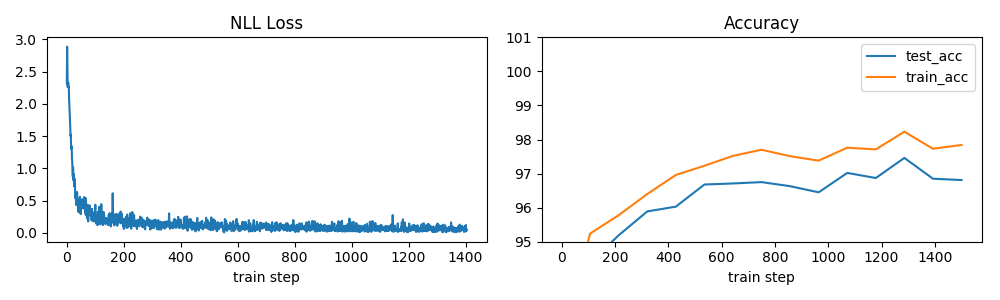
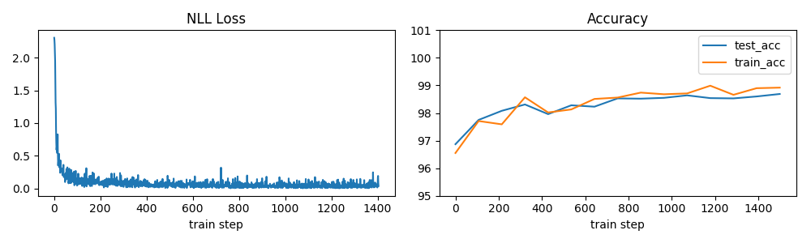

# Baselines
Sam Greydanus. 2018. MIT License.

_Written in PyTorch_

About
--------
A set of self-contained Jupyter notebooks aimed at providing quick and easy-to-modify baselines. Specifically:
 * [mnist-np](https://nbviewer.jupyter.org/github/greydanus/baselines/blob/master/mnist-np.ipynb) a 3-layer dense relu network implemented entirely in NumPy (test acc: 96.8%)
 	* [run the code on Colab](https://drive.google.com/file/d/12xF4Dc95F-25pRpi_VMmluSPsthGh2-W/view?usp=sharing)
 * [mnist-fc](https://nbviewer.jupyter.org/github/greydanus/baselines/blob/master/mnist-fc.ipynb) a 3-layer dense relu network implemented in PyTorch (test acc: 96.8%)
 	* [run the code on Colab](https://drive.google.com/file/d/1z2duhn5W4MCx6OeDe5-3DGDegxSurPqJ/view?usp=sharing)
 * [mnist-cnn](https://nbviewer.jupyter.org/github/greydanus/baselines/blob/master/mnist-cnn.ipynb) a 3-layer cnn relu network implemented in PyTorch (test acc: 98.7%)
  	* [run the code on Colab](https://drive.google.com/file/d/1KElrCHFesn1sRwP4RN-h409b1EqUNd2z/view?usp=sharing)
 * [mnist-seq](https://nbviewer.jupyter.org/github/greydanus/baselines/blob/master/mnist-seq.ipynb) a 3-layer dense recurrent (GRU) network implemented on a sequentual MNIST task
  	* [run the code on Colab](https://drive.google.com/file/d/19MGrJLitZ_o0i3VRhX9_KOIECAmHNKlf/view?usp=sharing)

I only trained these models on 1-3 epochs of MNIST, so they could probably do a little better. I wanted these baselines to be:
 * something I could train in ~2 minutes on my laptop
 * something that captured the general idea (of backprop, of neural nets, of cnns, of seq2seq models respectively)
 * something very reproducible (I save training stats and models along the way, etc.)
 * something easy to visualize/understand
 	* The code is minimal
 	* I plot training stats and a few examples at the end
 	* Each notebook is self-contained (minimal dependencies)

-> I don't include pretrained models for the MNIST baselines because each notebook runs in <5 minutes on a 2014 MacBook.
  
Dependencies
--------
* All code is written in Python 3.6. You will need:
 * NumPy
 * Matplotlib
 * [PyTorch 0.3+](http://pytorch.org/): easier to write and debug than TensorFlow :)
 * [Jupyter](https://jupyter.org/)
 * maybe my [Excitation Backprop code](https://github.com/greydanus/excitationbp)

Pretty Plots
---------

Pure numpy classifier

Dense classifier (PyTorch)

Convolutional classifier (PyTorch)

Sequential Model (PyTorch)

Visualizing sequential Model (PyTorch)

